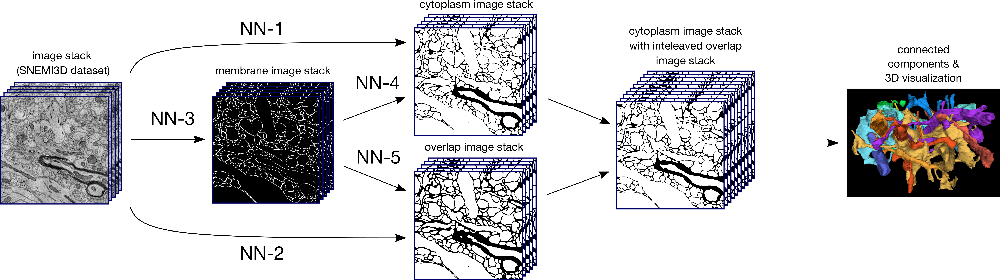

# Deep learning for dense reconstruction of neurons from electron microscopic images

*Note:* This repository is a subproject of https://github.com/tbullmann/heuhaufen.

### Prerequisites
- Windows, Linux or OSX (following getting started guide for Linux users)
- Python3
- CPU or NVIDIA GPU + CUDA CuDNN

### Requirements
- Argparse 1.4.0 
- Tifffile 2019.1.30
- Pillow 5.4.1
- Scipy 1.2.0
- Imageio 2.4.1
- Skimage 0.14.2
- Neuroglancer 1.0.11 (https://github.com/google/neuroglancer)

- Tornado 4.5.3 (*Note:* Make sure you installed the specified version for Tornado)
- Tensorflow 1.12.0 

##Getting started

-Create a new environment and install all requirements
(*Note:* for more in depth instructions see https://github.com/tbullmann/heuhaufen/blob/master/CONDA.md)

-Clone this repository

```bash
git clone https://github.com/mweber95/neuron3d.git
```

- Clone other repositories used for computation and visualization

```bash
git clone https://github.com/tbullmann/imagetranslation-tensorflow.git
```

- Symlink repositories

```bash
cd neuron3d
ln -s ../imagetranslation-tensorflow/ imagetranslation (Linux command)
```

- Create directory

```bash
mkdir datasets
```

- Place the following .tif files in the *datasets* folder
- Download the SNEMI3D dataset from http://brainiac2.mit.edu/SNEMI3D/home
- Download evaluation tif files from https://doi.org/10.5281/zenodo.3371325

# Background information of the workflow



The major goal of this thesis was to combine machine learning and deterministic algorithms
for a dense reconstruction of three dimensional objects such as neurons from a
series of EM images. In particular, my workflow combined established 2D CNNs suited
for image prediction with the classic connected components algorithm. Cytoplasm images
represent cross-sections of putative three-dimensional objects in the image stack,
whereas overlap images describe the individual connectivity of these cross-sections.
Therefore an intermediate representation consisting of cross-sections and corresponding
features for the final object prediction was used. There are several paths to go from
EM images to mentioned features, which are marked as NN-1 to NN-5. 

# Python scripts and associated functionalities

### *process3D.py*
- creating membrane images from SNEMI3D dataset (train-labels.tif)
- creating cytoplasm images from SNEMI3D dataset (train-labels.tif)
- creating overlap images from SNEMI3D dataset (train-labels.tif)
- postprocessing of overlap images
- converting png to tif
- converting tif to png
### *reconstruct3D.py*
- relabeling of final predicted cytoplasm and overlap images and preparation for evaluation and 3D visualization 
### *evaluate3D.py*
- Calculating adjusted RAND index, precision, recall and split and merge errors
### *neuroglancer3D.py*
- 3D visualization of relabeled predicted neurons via neuroglancer

# Guide for preprocessing, training, prediction

This guide is dedicated to the training of NN-3. It shows the basic workflow and principle of this pipeline.

### Splitting SNEMI3D dataset (*train-input/train-labels*) in 4 same sized parts

```bash
python tools/process3D.py \
  --operation split \
  --input_dir datasets/train-input.tif \
  --output_dir datasets/ \
  --split em
```

```bash
python tools/process3D.py \
  --operation split \
  --input_dir datasets/train-labels.tif \
  --output_dir datasets/ \
  --split label
```

### Generating membrane images

```bash
python tools/process3D.py \
  --operation membrane \
  --input_dir datasets/label_a.tif \
  --output_dir datasets/membrane_a
```

### Combining Input and Target for NN-Training

```bash
python imagetranslation/tools/process.py \
  --operation combine \
  --input_dir datasets/em_a \
  --b_dir datasets/membrane_a \
  --output_dir datasets/combined/
```

### Training 

Train the classifier for the direction "AtoB" (EM images to labels) using paired-to-image translation with a residual net as the generator:

```bash
python imagetranslation/translate.py   --mode train \
  --input_dir datasets/combined \
  --output_dir results/T3_em_membrane_a \
  --which_direction AtoB  --Y_loss square \
  --model pix2pix   --generator resnet \
  --fliplr   --flipud  --transpose \
  --max_epochs 2000  --display_freq 500 \
  --gan_weight 0
```

The `--fliplr   --flipud  --transpose` will provide data augmentation of factor of 8 by randomly rotating and flipping the training samples

The `--display_freq 500` will output an HTML file at `results/T3_em_membrane_a/index.html` that shows input/output/target image sets every 500 steps.

*The training may take 1 hour using a GPU, without you will be waiting for a day to finish the training.*

Meanwhile you can follow the training progress using the tensorboard:

```bash
tensorboard --logdir results/T3_em_membrane_a
```

Test the model

```bash
python imagetranslation/translate.py   --mode test \
  --checkpoint results/T3_em_membrane_a \
  --input_dir datasets/combined \
  --output_dir results/P3_em_membrane_b \
  --image_height 512  --image_width 512 \
  --model pix2pix
```

*It might take a while to load the model from the checkpoint, but computation is fast even without a GPU.*
The test run will output an HTML file at `results/P3_em_membrane_b/index.html` that shows input/output/target image sets.

# Guide for reconstruction, evaluation and 3D visualization

## Reconstruction

The reconstruction includes the reading of cytoplasm and overlap images, an interleaved arrangement of both stacks and subsequent relabeling and saving of the resulting tif.

- How to execute:

```bash
python tools/reconstruct3D.py \
   --input_dir_cytoplasm 'path/to/cytoplasm/images/' \
   --input_dir_overlap 'path/to/overlap/images/' \
   --output_dir 'output/path' \
   --name 'name_of_the_tif'
```

## Evaluation

All for prior downloaded evaluation tifs serve as true label for following evaluation. The evaluation is based on the final relabeled tif file derived from the *reconstruct3D.py* script. The evaluation tif depends on the last predicted cytoplasm and overlap images and their corresponding image stack.

- How to execute:

```bash
python tools/evaluate3D.py \
   --predicted 'name_of_the_predicted_tif' \
   --true 'evaluation_a-d.tif
```

## 3D Visualization

The 3D visualization can be executed with the *neuroglancer3D.py* script

- How to execute:

```bash
python tools/neuroglancer3D.py \
   --em 'path/to/em/tif/stack' \
   --label 'path/to/label/tif/stack' \
   --predicted 'path/to/predicted/tif/stack'
```
*Note:* predicted tif equals the reconstructed tif from *reconstruct3D.py*

# Automatic workflow

A full automatic workflow consisting of training, prediction and evaluation of NN-3, NN-4 and NN-5 is already attached to this repostiory.
- just execute the bash script in the neuron3d folder
```bash
bash experiment_8.sh
```
- This script takes around 4-5 hours with a Nvidia Tesla V100 and includes the training to predict membranes from EM images, cytoplasm from predicted membrane images and overlap from predicted membrane images.
